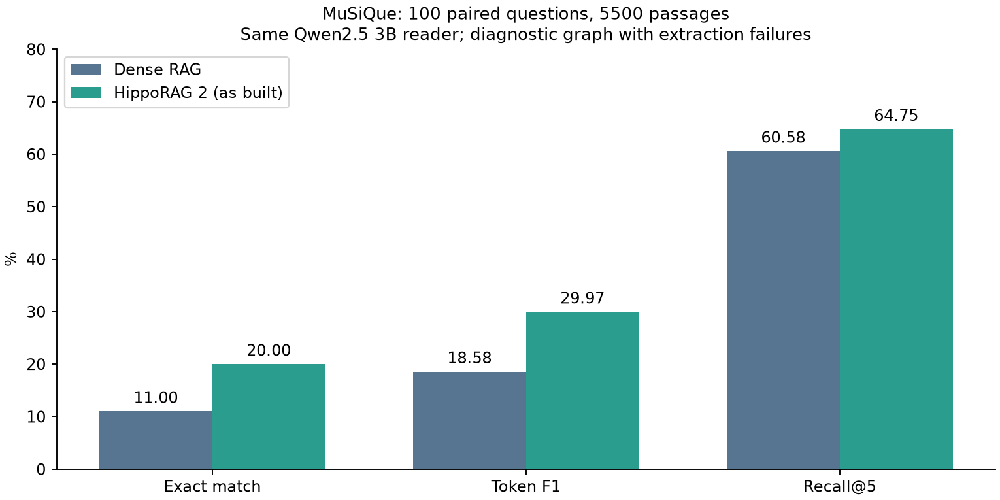

# Dense RAG против HippoRAG 2: выполненное локальное сравнение

26 сентября 2026. **Диагностический результат, не основной независимый benchmark.**

## Результат

Одинаковые 100 вопросов MuSiQue S500[200:300], один корпус из 5500 пассажей,
BGE-M3, общий reader Qwen2.5 3B Q4_K_M, top-5, seed 42, temperature 0,
контекст 4096, максимум 512 выходных токенов. 7B не использовалась.

| Метрика | Dense RAG | HippoRAG 2 | Разница |
|---|---:|---:|---:|
| Точные ответы (EM) | 11/100 | 20/100 | +9 п.п. |
| Token F1 | 18,58% | 29,97% | +11,38 п.п. |
| Recall@5 | 60,58% | 64,75% | +4,17 п.п. |

По F1 HippoRAG лучше на 31 вопросе, хуже на 10, одинаковый результат на 59.
По EM: 12 улучшений, 3 ухудшения, 85 совпадений.
Парный bootstrap (10000 выборок, seed 42): 95% интервал разницы F1
от +4,01 до +18,66 п.п.; EM от +2 до +17 п.п.; recall от −0,42 до +8,75 п.п.
Это описательная неопределённость для этой фиксированной выборки и конфигурации,
не доказательство превосходства на целевом API или всех вопросах MuSiQue.

## Что фактически выполнено

Dense run `98d8b412-cec6-45e4-9c14-0e4ad85855bb` переиспользован после проверки
SHA результата, корпуса, порядка ID, digest моделей, шаблона и параметров reader.
Новый HippoRAG QA run: `5e1bdc68-1803-416f-b80b-e5cc5b7b8dcf`.
Исходный индекс: `e78eff08-532a-40b3-a359-49a6b08b32a7`.

Индекс скопирован; SHA всех восьми исходных файлов совпали до и после работы.
Ни OpenIE, ни ремонт, ни пересборка индекса не выполнялись. Строгий OpenIE gate
не изменён и остаётся failed. Вместо ожидания идеального индекса измерено
поведение фактически построенной системы по ADR-0012.

Получены все 100 ответов. Reader HippoRAG: 100 завершений stop, ни одного length;
в одном ответе отсутствовал маркер Answer:, результат обработан общим оценщиком.
Dense: 99 stop и один length. Такие ответы не исключались из оценки.

HippoRAG использовал графовые факты на 78 вопросах; на 22 включился встроенный
переход к dense passage retrieval. Read-only разбор сохранённых ответов фильтра:
20 валидных пустых списков и 2 невалидных формата. Это часть результата системы,
а не успешные графовые ответы. В одном сообщении диагностики upstream возникла
ошибка кодировки консоли при печати невалидного ответа; такой ответ всё равно
не прошёл бы парсер и привёл к тому же fallback.

Native Ollama chat передаёт параметры контекста явно. Использованы исходный
текстовый DSPy fact-filter prompt и общий текстовый reader без JSON mode.
Это отдельная query-конфигурация; старые результаты OpenIE не изменялись.
Проверены размещение обеих моделей в GPU и runtime context reader 4096.
Максимум входных токенов: reader 2223, fact filter 3004; cap выхода 512.

## Расход и время

| Только LLM-токены запросов, без индексации | Dense | HippoRAG |
|---|---:|---:|
| Reader: вход + выход | 166622 | 165976 |
| Фильтр фактов: вход + выход | 0 | 298726 |
| Всего на 100 вопросов | 166622 | 464702 |
| Среднее на вопрос | 1666,22 | 4647,02 |

HippoRAG потратил примерно в 2,79 раза больше LLM-токенов на запросы.
Дополнительно у обеих систем по 2592 токена query embeddings; они не смешаны
с LLM usage. Новый прогон: ровно 100 fact-filter и 100 reader вызовов без retry.
Это локальные токены Ollama, не расход будущего внутреннего API.

Среднее end-to-end вопроса: Dense 1,27 с, HippoRAG 1,63 с. Запуски проводились
в разные моменты, поэтому это наблюдаемые времена, не контролируемый speed benchmark.
Полная историческая стоимость индексации неизвестна. Поэтому здесь нет вывода
об окупаемости графа или полном cost ratio с индексацией.

## Ограничения и смысл результата

- В исходном индексе остаются 160 unresolved OpenIE stage outcomes. Это не 160
  обязательно различных документов. Улучшение QA не доказывает их безвредность.
- Эмбеддер одинаковый, но package HippoRAG заменяет переводы строк пробелами;
  Dense сохраняет title-newline-text. Это сравнение текущих pipeline, не чистая
  изоляция влияния одного только графового алгоритма.
- После этого запуска candidate100 уже использован для анализа; не называть его
  нетронутым тестом при дальнейшей настройке. holdout100 не использован.
- Целевой API/T4, HotpotQA, RAPTOR, стоимость полного исследования и router
  этим опытом не проверены. Локальные пороги нельзя выдавать за подтверждение
  основной гипотезы задания.

**Вывод:** на этой выборке существующая локальная конфигурация HippoRAG дала
больше точных ответов и выше F1, ценой дополнительных запросов фильтра фактов.
Сравнение теперь получено; следующий этап — перенос проверенного протокола
на целевой API с пилотной оценкой токенов, а не автоматическая новая индексация.

## Проверка и воспроизведение

Без модельных вызовов: `python -m scripts.compare_asbuilt` проверяет входные
артефакты. Реальный повтор: `python -m scripts.compare_asbuilt --execute` через
закреплённое HippoRAG-окружение; создаёт новый run и новую копию, до 200 chat
запросов. Не запускать повторно без причины. Для консоли Windows установить
`PYTHONIOENCODING=utf-8`. Локальные исходные данные и индекс необходимы;
публичный репозиторий их не включает.

Проверены SHA и точные ID результата, неизменность исходного индекса,
152 unittest (2 pinned-only пропущены в основной среде), оба pinned-only теста
отдельно; pip check обеих сред без конфликтов. Новые тесты покрывают отказ
при несовпадении корпуса/модели, порядок пар, bootstrap и отсутствие скрытого retry.

[Машиночитаемая сводка](../results/summary/dense-vs-hipporag-asbuilt100.json)
содержит digest моделей, SHA, метрики, расходы и интервалы.
[Решение до прогона](../.adr/0012-as-built-diagnostic-comparison.md).
Полные ответы, запросы и контексты сохранены только локально в игнорируемых
results/raw и storage; исходные результаты не переписаны.
