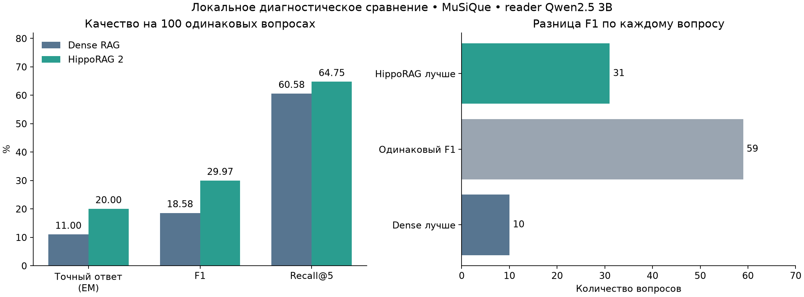
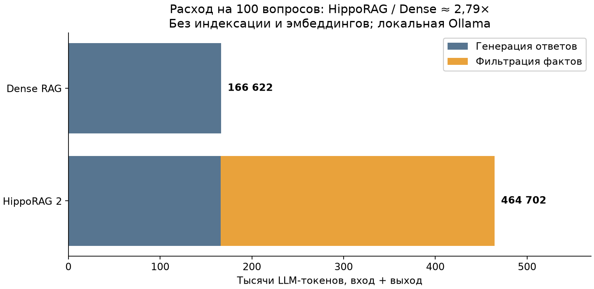

# Dense RAG и HippoRAG 2 — результаты и недочёты

Отчёт на 28 сентября 2026. Сравнение выполнено 26 сентября.

Привет, получилось сравнить Dense RAG и HippoRAG 2 локально на одинаковых
100 вопросах MuSiQue и корпусе из 5500 пассажей. У обеих систем BGE-M3,
одинаковый reader Qwen2.5 3B Q4_K_M и top-5. Ниже результаты и то, что пока
не получилось довести до нормального исследовательского протокола.

**Это диагностическое сравнение текущих реализаций, не основной независимый benchmark.**

## Что получилось

| Метрика | Dense RAG | HippoRAG 2 | Разница |
|---|---:|---:|---:|
| Точных ответов (EM) | 11/100 | 20/100 | +9 п.п. |
| F1 | 18,58% | 29,97% | +11,38 п.п. |
| Recall@5 | 60,58% | 64,75% | +4,17 п.п. |

EM — полное совпадение ответа с эталоном после нормализации; F1 учитывает
совпадение слов; Recall@5 — долю найденных опорных пассажей среди пяти результатов.

По F1 HippoRAG оказался лучше на 31 вопросе, хуже на 10, на 59 результат одинаковый.
Парный bootstrap даёт 95% интервал разницы F1 от +4,01 до +18,66 п.п.
Для Recall@5 интервал от −0,42 до +8,75 п.п. включает ноль: уверенного вывода
об улучшении поиска по этой выборке нет. Эти интервалы не устраняют ограничения
данных и конфигурации и не доказывают превосходство на целевом API.

## Сколько токенов потребовалось

| LLM-токены на 100 вопросов, вход + выход | Dense RAG | HippoRAG 2 |
|---|---:|---:|
| Генерация ответов | 166 622 | 165 976 |
| Фильтрация фактов при поиске | 0 | 298 726 |
| Всего без индексации | 166 622 | 464 702 |

HippoRAG потратил примерно в **2,79 раза больше LLM-токенов на вопросы**.
Основная прибавка — фильтрация фактов. Дополнительно у обеих систем по 2592
токена эмбеддингов вопросов, они не включены в таблицу.

Это расход локальной Ollama, не будущего внутреннего API. Полная историческая
стоимость построения графа неизвестна, поэтому про окупаемость пока выводов нет.

## Наши недочёты

1. **Слишком долго занимались ремонтом вместо сравнения.** После ошибок OpenIE
   работа ушла в повторные попытки, проверки и восстановление индекса. В итоге
   отдельно измерили уже построенную систему с её ошибками. Это позволило
   получить результат, но не означает, что ошибки исправлены.

2. **Граф не прошёл строгую проверку извлечения.** Осталось 160 неуспешных
   этапов NER/triples; это не обязательно 160 разных документов. Индекс
   не перестраивали, ошибки не скрывали, исходные данные сохранили. Пока
   неизвестно, насколько именно эти ошибки изменили итоговые метрики.

3. **HippoRAG не всегда использовал граф.** На 22 вопросах включился встроенный
   переход к dense-поиску: в 20 случаях фильтр вернул валидный пустой список
   фактов, в двух — ответ неправильного формата. Результат в таблице относится
   ко всей системе с этим поведением, а не только к успешным графовым запросам.

4. **Учёт первоначальной индексации неполный.** Были несколько попыток,
   переиспользование кэша и события с неизвестным usage. Полный расход нельзя
   честно восстановить. В новом QA-прогоне учтены все 100 вызовов фильтра
   и 100 вызовов reader без повторов.

5. **Условия ещё не полностью унифицированы.** Эмбеддер одинаковый, но
   HippoRAG заменяет переводы строк пробелами, а Dense сохраняет их.
   Новый HippoRAG QA использует native Ollama с явными параметрами контекста.
   Это сравнение текущих pipeline, не чистая изоляция влияния графового поиска.

6. **Есть ошибки формата ответов.** Все 100 генераций HippoRAG завершились
   без обрыва, но в одном ответе отсутствовал маркер `Answer:`. У Dense
   один ответ завершился по лимиту длины. Эти случаи не исключали из оценки.

7. **Выводы пока ограничены локальным опытом.** Только 100 вопросов одного
   датасета и маленькая модель. После анализа эта выборка уже не является
   нетронутой для последующей настройки. `holdout100` не использовали.
   Целевой API/T4, HotpotQA, RAPTOR и маршрутизатор пока не проверены.

## Что предлагаю дальше

Сначала согласовать конфигурацию целевого API и правила обработки ошибок.
Затем провести небольшой пилот, проверить совместимость и измерить расход
на документ и вопрос. Только после этого оценивать полную индексацию в рамках
90М токенов, с отдельным резервом на ошибки и повторы.

Подготовку данных, общий reader, оценщик, сохранение результатов и отчёты
можно переиспользовать. Работу на ещё недоступном API пока не считаю проверенной.

## Где посмотреть

- [Draft PR #1](https://github.com/SPStan/rag-graphrag-research/pull/1), результат добавлен коммитом `f916273`.
- [Подробный технический отчёт](COMPARISON_2026-09-26.md).
- [Машиночитаемая сводка с хэшами, моделями и usage](../results/summary/dense-vs-hipporag-asbuilt100.json).
- [Решение о диагностическом сравнении](../.adr/0012-as-built-diagnostic-comparison.md).

Dense run: `98d8b412-cec6-45e4-9c14-0e4ad85855bb`.
HippoRAG QA run: `5e1bdc68-1803-416f-b80b-e5cc5b7b8dcf`.

Сырые ответы, корпус и индекс остаются локально; публичный отчёт содержит
только агрегаты. Для отправки Markdown отдельным файлом нужны также две
картинки из `docs/assets`; в GitHub они отображаются по относительным ссылкам.
